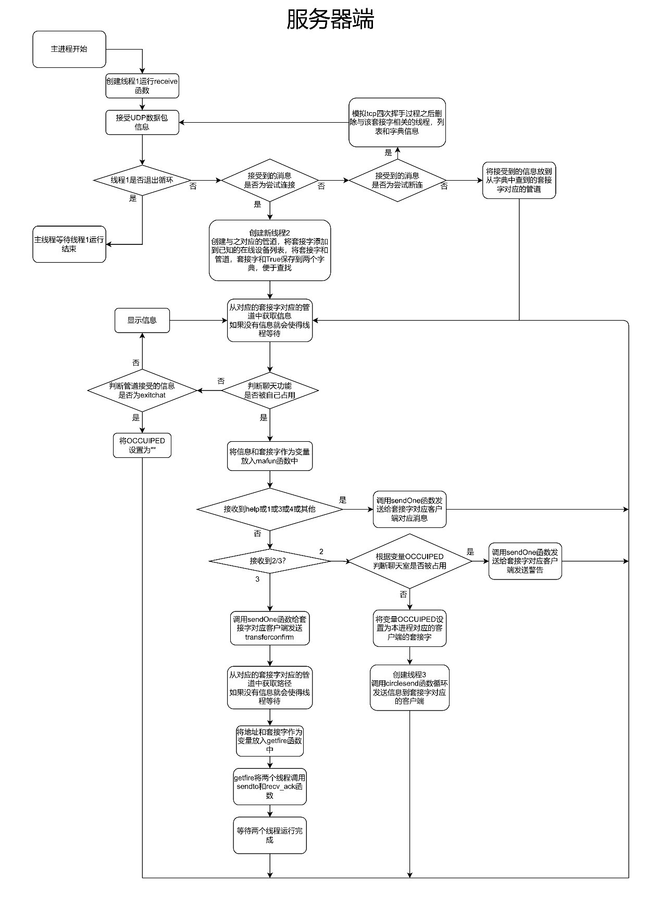
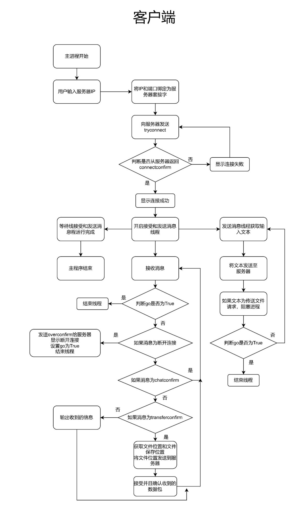

# UDP服务器的设计

## 1、	设计目的

UDP是TCP/IP协议族为传输层设计的两个协议之一，是一种无连接的，不可靠的协议。由于UDP采取了无连接的方式，因此协议简单，在一些特定的应用中协议运行效率高。UDP适合一些实时的应用，如IP电话、视频会议，它们要求源主机以恒定的速率发送数据，并且在网络出现拥塞时，可以丢失一些数据，但是延迟不能太大。基于这些特点，流式多媒体通信、多播等应用在传输层采用的就是UDP协议。编写一UDP服务器程序，流畅地完成视频文件地传输，要能对多个客户端进行管理。需要通过UDP模拟多个客户端连接验证的情况。

## 2、	设计思路

解决问题的思路，包括所用的工具、调用的函数库（如Winpcap）

### 1)	工具：

a)	编译环境：Python3.10

b)	编译工具：PyCharm

c)	打包工具：pyinstaller

### 2)	调用函数库：

a)	time：处理时间的标准库，提供获取系统时间并格式化输出功能

b)	socket：帮助在网络上的两个程序之间建立信息通道

c)	queue：提供队列操作的模块，用于多个线程之间的数据共享

d)	basename：去掉目录路径，单独返回文件名

### 3)	解决问题思路

本程序由于需要在网络上搭建UDP服务器来传输信息、文件，则必须要定义一个合适的确认连接以及检验文件完成性的功能。

以TCP传输模式为样例，本程序的服务器端和客户端采用了类似TCP的三次握手确认连接和四次挥手断开连接。

本程序采用类似FTP传输模式，利用6000端口来传送控制信息以及一些普通消息，利用7777端口来传输文件信息，利用7778端口来接收ack数据包确认信息。

服务器端主进程开启接受消息线程，该线程负责接受捕获到的6000端口的UDP数据包，并将判断数据是否为连接、断开等命令数据。

如接收到连接指令则将信息发送方的套接字保存创建新线程负责处理该线程发送来的信息并且创建新管道方便与之通信。

如果是断开连接命令，则在“四次挥手”结束后结束该套接字对应的线程，释放资源。如果是其他命令，则将命令存放到信息来的套接字对应的管道中。

管道另一头接受到信息后开始处理对应信息。处理不同套接字的消息的进程在从套接字中取到消息后开始执行程序。如果将信息通过默认命令消息处理函数处理后返回不同对应的信息，如果服务器需要执行聊天操作，则会创建新线程调用循环发送函数给该套接字发送消息。如果服务器需要执行发送文件操作则需等待客户机发送所需要的文件目录后创建两个新线程一个负责在7777端口发送文件，另一个是负责在7778端口接收确认包。

客户端程序只需要获取服务器ip后主动连接服务器。在服务器相应后显示连接成功。同时启动两个线程，一个负责发送数据包，另一个负责接收数据包并处理。

处理数据时，如果为传输文件确认数据包，则阻塞发送数据包的线程，并把需要的文件路径发送至服务器。然后通过对接收到服务器7777端口发送来的数据进行整理，返回给服务器7778端口确认包。全部确认后文件传输完成并唤醒发送数据进程。

如果发送的数据为exit（断开连接命令），将状态变量改变，使得发送和接受线程全部停止，主进程等待两个线程结束后结束运行。

## 3、	总体设计

设计流程图

## 4、	详细设计

函数列表：

| 所处位置 | 函数名     | 参数                          | 描述                                                       |
| -------- | ------------- | ------------------------------- | ------------------------------------------------------------ |
| 服务器端 | sendto        | 传输文件名称,客户端套接字 | 用于传输文件                                           |
| 服务器端 | recv_ack      | 无                             | 确认客户端返回的确认信息                         |
| 服务器端 | sendOne       | 消息,发送到的客户机的套接字 | 整合发送一条udp消息到指定套接字                |
| 服务器端 | circlesend    | 发送到的客户机的套接字 | 循环发送消息到客户端（基于聊天功能）       |
| 服务器端 | getfire       | 文件路径,发送到的客户机的套接字 | 获取文件函数，用于启动发送文件进程和确认客户端返回的确认进程 |
| 服务器端 | mafun         | 消息,发送到的客户机的套接字 | 默认命令消息处理函数                               |
| 服务器端 | diviceConnect | 发送到的客户机的套接字 | 连接到服务器后的设备所启动线程调用的函数 |
| 服务器端 | receive       | 无                             | 接受消息并将消息送到管道                         |
| 客户端 | getFile       | 文件名                       | 获取文件路径，名称                                  |
| 客户端 | receive       | 无                             | 接受消息                                                 |
| 客户端 | circlesend    | 无                             | 发送消息                                                 |

